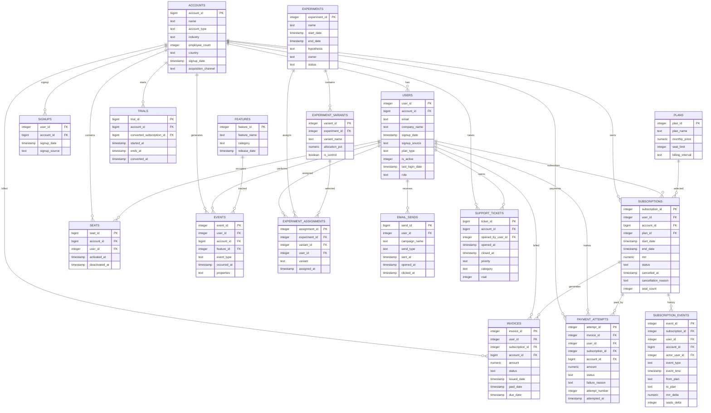

# SaaS Platform Database ER Diagram

> Legacy tables have been excluded:
>
> - legacy_companies
> - legacy_events
> - legacy_invoices
> - legacy_subscriptions
> - legacy_support_tickets

```mermaid
erDiagram

    ACCOUNTS {
        bigint account_id PK
        text name
        text account_type
        text industry
        integer employee_count
        text country
        timestamp signup_date
        text acquisition_channel
    }

    USERS {
        integer user_id PK
        bigint account_id FK
        text email
        text company_name
        timestamp signup_date
        text signup_source
        text plan_type
        integer is_active
        timestamp last_login_date
        text role
    }

    SIGNUPS {
        integer user_id FK
        bigint account_id FK
        timestamp signup_date
        text signup_source
    }

    PLANS {
        integer plan_id PK
        text plan_name
        numeric monthly_price
        integer seat_limit
        text billing_interval
    }

    SUBSCRIPTIONS {
        integer subscription_id PK
        integer user_id FK
        bigint account_id FK
        integer plan_id FK
        timestamp start_date
        timestamp end_date
        numeric mrr
        text status
        timestamp cancelled_at
        text cancellation_reason
        integer seat_count
    }

    SUBSCRIPTION_EVENTS {
        integer event_id PK
        integer subscription_id FK
        integer user_id FK
        bigint account_id FK
        integer actor_user_id FK
        text event_type
        timestamp event_time
        text from_plan
        text to_plan
        numeric mrr_delta
        integer seats_delta
    }

    INVOICES {
        integer invoice_id PK
        integer user_id FK
        integer subscription_id FK
        bigint account_id FK
        numeric amount
        text status
        timestamp issued_date
        timestamp paid_date
        timestamp due_date
    }

    PAYMENT_ATTEMPTS {
        integer attempt_id PK
        integer invoice_id FK
        integer user_id FK
        integer subscription_id FK
        bigint account_id FK
        numeric amount
        text status
        text failure_reason
        integer attempt_number
        timestamp attempted_at
    }

    TRIALS {
        bigint trial_id PK
        bigint account_id FK
        bigint converted_subscription_id FK
        timestamp started_at
        timestamp ends_at
        timestamp converted_at
    }

    SEATS {
        bigint seat_id PK
        bigint account_id FK
        integer user_id FK
        timestamp activated_at
        timestamp deactivated_at
    }

    FEATURES {
        integer feature_id PK
        text feature_name
        text category
        timestamp release_date
    }

    EVENTS {
        integer event_id PK
        integer user_id FK
        bigint account_id FK
        integer feature_id FK
        text event_type
        timestamp occurred_at
        text properties
    }

    EXPERIMENTS {
        integer experiment_id PK
        text name
        timestamp start_date
        timestamp end_date
        text hypothesis
        text owner
        text status
    }

    EXPERIMENT_VARIANTS {
        integer variant_id PK
        integer experiment_id FK
        text variant_name
        numeric allocation_pct
        boolean is_control
    }

    EXPERIMENT_ASSIGNMENTS {
        integer assignment_id PK
        integer experiment_id FK
        integer variant_id FK
        integer user_id FK
        text variant
        timestamp assigned_at
    }

    EMAIL_SENDS {
        bigint send_id PK
        integer user_id FK
        text campaign_name
        text send_type
        timestamp sent_at
        timestamp opened_at
        timestamp clicked_at
    }

    SUPPORT_TICKETS {
        bigint ticket_id PK
        bigint account_id FK
        integer opened_by_user_id FK
        timestamp opened_at
        timestamp closed_at
        text priority
        text category
        integer csat
    }

    ACCOUNTS ||--o{ USERS : has
    ACCOUNTS ||--o{ SUBSCRIPTIONS : owns
    ACCOUNTS ||--o{ INVOICES : billed
    ACCOUNTS ||--o{ PAYMENT_ATTEMPTS : payments
    ACCOUNTS ||--o{ EVENTS : generates
    ACCOUNTS ||--o{ TRIALS : starts
    ACCOUNTS ||--o{ SEATS : contains
    ACCOUNTS ||--o{ SUPPORT_TICKETS : raises
    ACCOUNTS ||--o{ SIGNUPS : signup

    USERS ||--o{ SUBSCRIPTIONS : subscribes
    USERS ||--o{ EVENTS : performs
    USERS ||--o{ EMAIL_SENDS : receives
    USERS ||--o{ EXPERIMENT_ASSIGNMENTS : assigned
    USERS ||--o{ PAYMENT_ATTEMPTS : makes
    USERS ||--o{ INVOICES : billed
    USERS ||--o{ SEATS : occupies
    USERS ||--o{ SUPPORT_TICKETS : opens

    PLANS ||--o{ SUBSCRIPTIONS : selected

    SUBSCRIPTIONS ||--o{ INVOICES : generates
    SUBSCRIPTIONS ||--o{ PAYMENT_ATTEMPTS : paid_by
    SUBSCRIPTIONS ||--o{ SUBSCRIPTION_EVENTS : history

    FEATURES ||--o{ EVENTS : tracked

    EXPERIMENTS ||--o{ EXPERIMENT_VARIANTS : contains
    EXPERIMENTS ||--o{ EXPERIMENT_ASSIGNMENTS : assigns

    EXPERIMENT_VARIANTS ||--o{ EXPERIMENT_ASSIGNMENTS : selected
```
